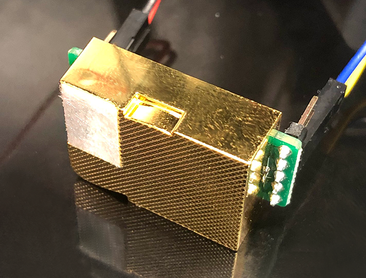
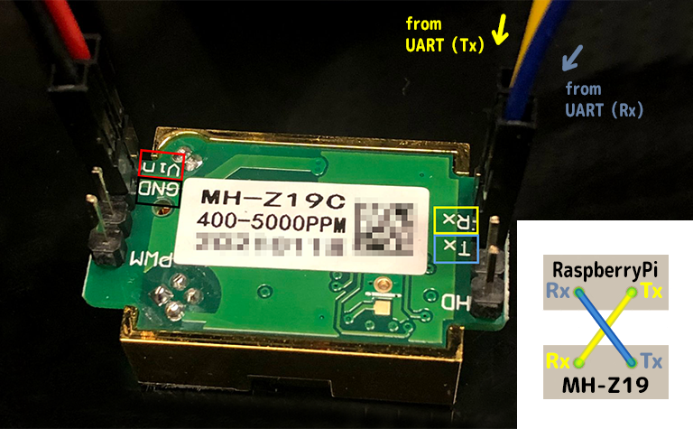

<p align="center">
  
</p>

## Overview

This plug-in is for displaying the carbon dioxide concentration measurement result of MH-Z19 on HomeKit through homebridge.
### Wiring diagram




### Preparation settings

#### ① Enable serial port

#### ② Give read permission to the homebridge user on the serial port

## Install
### Configuration example of config.json

```
    "accessories": [
        {
            "accessory": "CO2Sensor",
            "name": "CO2 Sensor",
            "uart_path": "/dev/ttyXXX",
            "schedule": "*/5 * * * *",
            "warning_level": 1500
        }
    ]
```
* `accessory` → Fixed value [required field]
* `name` → To your liking [required field]
* `uart` → Specify the UART to which MH-Z19 is connected in ttyXXX format.
* `schedule` → Specify the acquisition interval of CO2 concentration.
* `warning_level` → A warning will be displayed when CO2 exceeds this level.